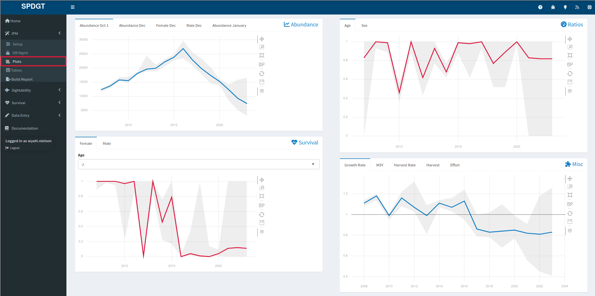
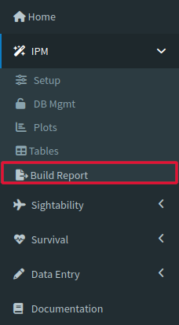
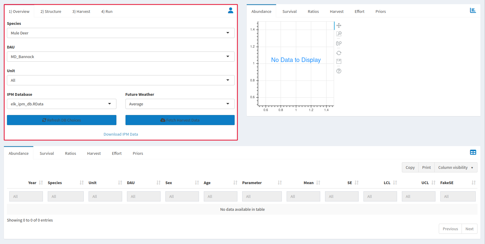
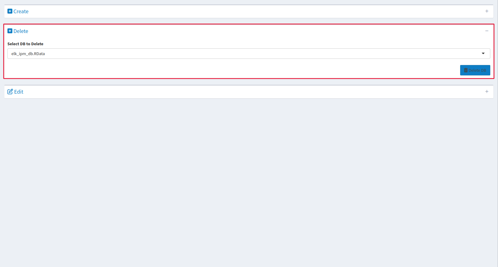
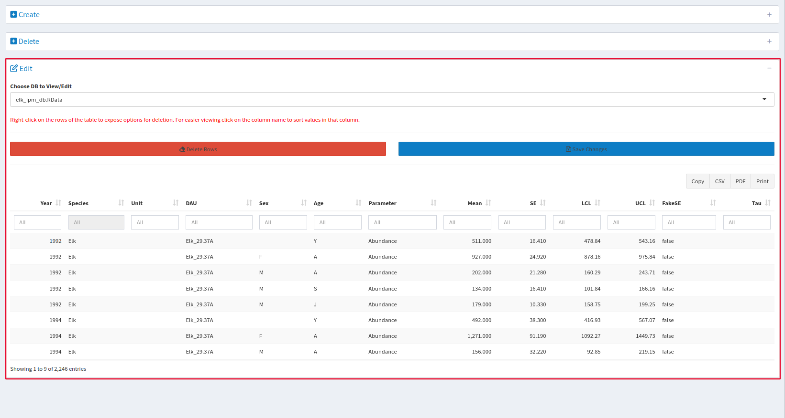
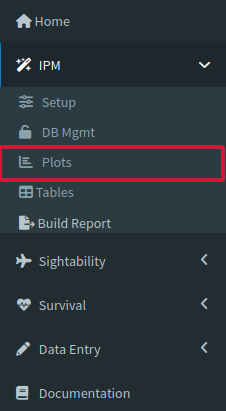
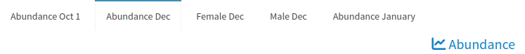
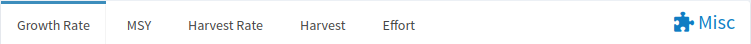
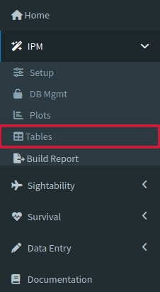

# IPM {#ipm}

An Integrated Population Model(IPM), jointly analyzes data on population size and demographic parameters. Data collected in the field inform the demographic parameters in the model and unifying the analyses of multiple sources of data. Field data in the IPM database may come from the outputs from survival models and sightability models run in the PopR website, analysis done by a specific agencies, and/or agency specific databases. The IPM analyzes populations at the [<b>DAU</b>](#gl-DAU){style="color: #086e04;"} level.

## Walkthrough {#ipm-model}

Using the IPM tool can be split into two major processes: preparing data and reviewing outputs.

### Preparing Data {#ipm-load}

Click on the Setup tab, the first dropdown under the IPM tool menu.

On the top left of the page should be a window labeled Overview, and this is where you determine the data that you run through the IPM. Select the database you want to retrieve the data from, then make sure you choose your [<b>Species</b>](#gl-species){style="color: #086e04;"}, [<b>DAU</b>](#gl-dau){style="color: #086e04;"}, [<b>Unit</b>](#gl-unit){style="color: #086e04;"}, and Weather before you click [<b>Fetch Harvest Data</b>]{style="color: #196eb0;"} on the bottom right of the Overview window to retrieve the specific data you requested.

Once the data is loaded, you should get a popup dialog letting you know that the process was successful. It will also prompt you to proceed to the Structure tab.

The Structure tab allows you to select the model structure used in the analysis. For some agencies, the use of population reconstruction or other structural components may be available as structural options. The primary set-up options are to define whether your survival and reproduction will vary annually or be constant. The defaults were chosen to be well-suited to the specific species selected, so most of the time clicking [<b>"Default Structure"</b>]{style="color: #196eb0;"} is a good start for your analysis. The inputs that appear when the tool is opened may not revert to the species specific defaults so clicking on [<b>"Default Structure"</b>]{style="color: #196eb0;"}, will make sure you have selected the defaults before you move on to Harvest.

After you select your Structure, you can move on to the Harvest Tab. Decide your effort variable and the years that you will be conducting your analysis, then look at the given information for the years that will be forecast. You can change the Harvest by double clicking the numbers and typing in new entries.

Our next step is the Run tab, which again already has a decent set of default values loaded. Adjust your [<b>Burnin Length</b>](#gl-burnin){style="color: #086e04;"}, [<b>MCMC Iterations</b>](#gl-mcmciter){style="color: #086e04;"}, and [<b>Thinning Rate</b>](#gl-thin){style="color: #086e04;"}. Decide whether you would like to [<b>Automate Convergence</b>](#gl-autoconv){style="color: #086e04;"} (This may increase the time it takes to run the model).

Once you are satisfied with all of the inputs outlined above, click [<b>Fit Model</b>]{style="color: #196eb0;"} to begin analysis. This should take some time, but you will get a dialog box letting you know when the process is complete

### Reviewing Outputs {#ipm-look}

<b>(NOTE: This section will only work if you completed the steps above to prepare your data and fit your model beforehand.</b>)

To look at the model output, wait until the model that you initiated in the setup tab has finished running, then go ahead and click the Plots tab on the IPM dropdown menu to check the results. Hovering your mouse over a point on a plot will give you the parameter, year, age, sex, control limits, and mean associated with the dataset that created the data point. These plots also contain the analogous data from the IPM inputs, so you can compare the model output with the data that was provided as inputs to the model.

You can also check the model output by clicking the Tables tab right below the Plots one on the IPM dropdown. Rhat values greater than 1.1 are highlighted in red, which means the model may not have converged and should be run again after modifying the settings on the Run tab in the Setup tool. The first ten entries that appear when you open the table tab are not the only outputs of the model. You will notice that you may navigate the pages with the list to the bottom right, or you may increase the number of entries visible at the top left of the page, using the [<b>Show (10) Entries</b>]{style="color: #196eb0;"} dropdown.

As a final step to get more diagnostic information, use the Build Report tool. 

Simply click on the tool and then click the download prompt on the popup window. The resulting document contains interactive plots as well as model specifications and fit.

## Reference {#ipm-ref}

### Setup {#ipm-setup}

The main purpose of the Setup tab is to load and preview data that will be used for later analysis, and we will spend more time describing each element in detail. The window on the top left of the page has several tabs related to data preparation labeled Overview, Structure, Harvest, and Run.

The Overview tab helps you find the data you will be loading for your IPM. Make sure that you are pulling from the correct database! Also, the Future Weather dropdown allows you to consider weather in your IPM analysis. Average assumes mean observed weather conditions, Good assumes upper 95% quantile of observed weather, and Bad assumes lower 5% quantile of observed weather. You may also choose not to include weather in your analysis. All of these values were developed from the dissertation of Mark Hurley.

The Structure tab gives our model some information about assumptions. Population reconstruction is the process of estimating past abundance using a combination of known harvest data and estimated natural mortality rates. If you know when an animal died AND how old it was when it died, then you also know when it was alive. Using this "back-tracking" can create an abundance estimate for past years even if one was not carried out.

The Harvest tab gives our model some important context on harvest metrics. The slider at the top tells our model which years are being analyzed. The effort variable allows us to choose whether effort is determined by the number of days in the field or the number of hunters themselves. It also gives more context to our harvest numbers and helps us tease apart the relationship that hunter effectiveness and raw number of hunters had on the harvest that year. You may also give hypothetical harvest numbers for our model to consider so you may estimate the effects of management decisions on rates like survival and abundance.

The Run tab gives direction to our actual modeling process. The given settings control how we deal with the many thousands of times the model must run to calibrate itself. Adjust your [<b>Burnin Length</b>](#gl-burnin){style="color: #086e04;"}, [<b>MCMC Iterations</b>](#gl-mcmciter){style="color: #086e04;"} and [<b>Thinning Rate</b>](#gl-thin){style="color: #086e04;"}. The bottom of the window gives an option for [<b>Automating Convergence</b>](#gl-autoconv){style="color: #086e04;"} as well. You may adjust any of these factors, but the defaults are appropriate for a wide variety of situations.

The window on the top right of the page is for previewing and exploring the data that will create your analysis. Keep in mind that at this stage you are looking at the model input rather than the output, which is located in Plots and Tables. You can view [<b>Abundance</b>](#gl-abundance){style="color: #086e04;"}, [<b>Survival</b>](#gl-surv){style="color: #086e04;"}, [<b>Sex Ratios</b>](#gl-sexratio){style="color: #086e04;"}, Harvest numbers, and [<b>Hunter Effort</b>](#gl-huntereffort){style="color: #086e04;"}, as well as our Prior distribution for population parameters. A priors distribution gives a range of possible values for each of the factors that are considered by the IPM such as recruitment, survival, and mortality and then the likelihood of each value. This allows the model to consider historical data, but does not give too much power to outlier values. Just because a deer population lost 90% of their population in one year historically does not necessarily mean that it is likely to happen again in future years, but it should not be completely ignored either.

You can explore your graphs in this section with the pan and two zoom features on the side of each graph. Click the reset button to return to the original view. If any of these tabs are blank, it means that the dataset you picked does not have the relevant data to populate it.

The table at the bottom of the page gives another way to preview the data you loaded in the Overview tab. Use the blank column headers to look through your data with their keyword search function. You can page through your data with the previous and next buttons at the bottom of the page.

### Database Management {#ipm-dbmgmt}

The DB Mgmt tab creates, deletes and edits databases.The tools may be minimized, but to open them for use just click on the plus sign on the right side of the box containing the tool. Press it again to minimize it. Note that because databases are shared between users, edits here will change databases for EVERYONE. Data losses and changes will be permanent if you do not back up your data. You can also use the Create window to make a new database. NOTE: for some users this feature is only available for administrators and you may need to contact your administrator to create a new database or delete or edit an existing entry.

When using the Create window you can paste data from a spreadsheet app like Excel. You can also start off with data from any existing database, which you can select under the Historic Data box. once the data is loaded, you can filter the entries by usinf the blank box at the top of each column as a keyword search bar. Make sure to give your new database a name, and then click the create database button to add a database to the Speedgoat server! You can also use the download tool to get the data you have loaded into our servers as a .csv.

The Delete DB tool will delete the database you select from the server. Deleting it here will delete it for everyone, so make sure that your data is backed up and that nobody is still working on a database before you delete it.

The Edit tool allows you to add and delete rows of data from the database selected in the menu at the top of the tool. None of the edits you make will be applied until the Save Changes button is clicked, but once that button is clicked changes will be applied for everyone that uses that database.

### Plots {#ipm-plot}

The plots page displays the outputs of the IPM. Use the zoom and pan tools to change your view of the graph, and use the reset button to return to your original view.

Though there are only four windows to display data, each of these windows can be changed by selecting the options across the top. Pictured are the options given for the Abundance window, which allows us to explore [<b>abundance</b>](#gl-abundance){style="color: #086e04;"} during different times of year, as well as separating measurements by sex.

The ratios window allows us to break down the demographics that make up our study population, either by [<b>age</b>](#gl-ageratio){style="color: #086e04;"}.  or [<b>sex</b>](#gl-sexratio){style="color: #086e04;"}. This tab may also contain an age distribution plot that breaks down either proportion of the population or counts of the population by age. This plot is generated based on the expectation that the current population is broken down into ages based on the current survival rate of the specified age and sex class and may not be an accurate representation of the population age structure.

The survival window displays survival through the years for both males and females. Within each sex's tab, you can also select the age group of the animal to compare rates between adults and juveniles.

The Misc window contains many rates that are useful for understanding a population. Growth rate tracks how a population grows as a proportion of the population of the year before. For example, if a population of 100 animals grows by 50 in one year, the growth rate would be 0.5. MSY allows you to select which vital rate will be displayed on your y-axis. Lambda measures growth year by year, recruitment measures population growth, but specifically how many juveniles became adults in a population and how many adults immigrate into a population. Harvest and Harvest rate are often confused, but mean slightly different things. Harvest is the number of animals whose cause of death would be hunter-related, where harvest rate is the proportion of the population that was harvested. Effort measures how hunters put pressure on a population, and is either measured by the number of hunters on the landscape or how many cumulative days that hunters spent in the field. Note: these plots may be customized depending on your agencies needs, so the plots you see may not be the same as the ones pictured here.

### Tables {#ipm-table}

On the Tables page you can download and edit the data you are using for analysis. You can download your data here as well, but note that you will only download the data being displayed to you. By default, the table only shows the first ten entries of your dataset, so if you would like to download your data here make sure you change the dropdown at the top of the window from Show 10 entries to Show All entries.

### Build Report {#ipm-report}

The Build Report tool gives a summary of the analysis conducted, while keeping relevant information like model settings for future comparisons.
