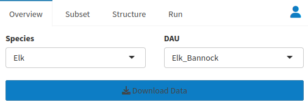

# Survival {#surv}

Survival is something often calculated in a classroom setting, but the practicalities of calculating it in the real world can make things very tricky. Small sample sizes that can be found in collar studies can present a few problems, even if everything goes to plan. For example, if a collar study is composed of 4 animals, 3 of them may die (maybe it was deer opener). However, our Kaplan Meier model is telling us that 75% of our deer are dead! Is survival for that year really 0.25? Unless you know of some catastrophe this is very unlikely. Our five deer study poses another problem, which is that the hypothetical 0.2 we produced earlier is one of only 5 possible survival rates that can come from this population!(0, 0.25, 0.5 ,0.75, 1) If true survival is 0.66, then we have a problem because there is no possible way to get that output from our model. All of this is assuming that things go to plan, things like:\

All deer were collared at the same time\
All dead deer were found with their collar\
All collars worked for the duration of the study\

Things often do not go to plan, and so more complicated models need to be created to account for for the reality of survival studies. Our models can consider mortality and survival data from the entire state/province as well as information from your particular DAU of interest. If there is sufficient data for your target DAU the model will use that information, but in the case that there isn't enough, the model can dip into a state-wide database that includes all capture and mortality data for the month in order to fill in gaps. Keep this in mind when your data is scarce, as the less data you have the closer your estimate will come to the state average.

## Walkthrough {#surv-walk}

Using the Survival tool can be split into three major processes: preparing data, reviewing outputs, and uploading data. 

### Preparing Data {#surv-prep}

The first step is to obtain your data. Click Setup under the Survival dropdown. 

You will notice a window at the top left of the page labeled Overview, and this is where you will decide the [<b>species</b>](#gl-species){style="color: #086e04;"} and [<b>DAU</b>](#gl-dau){style="color: #086e04;"} that we will be analyzing. Once you have made your selections, click [<b>Download Data</b>]{style="color: #196eb0;"} at the bottom of the window. 

Now that your data is loaded, feel free to look it over using the windows to the right of and below the Overview window. 

Once you have looked over your data, we can move on to the next step by navigating to the Subset tab next to the Overview one. Select the sex and age of the animals you will be analyzing, as well as the years your analysis will take place. 

We will next move on to the Structure window, where we will determine our model type, as well as our variances for sex, time, and space. We can also choose to censor harvest mortalities. 

Once you have made your choices, you can move on to the Run tab. Under the run tab, decide your [<b>Burnin Length</b>](#gl-burnin){style="color: #086e04;"}, [<b>MCMC Iterations</b>](#gl-mcmciter){style="color: #086e04;"}, and [<b>Thinning Rate</b>](#gl-thin){style="color: #086e04;"}, then decide whether or not you would like to [<b>Automate Convergence</b>](#gl-autoconv){style="color: #086e04;"}. We have provided a set of defaults that are well suited for a variety of situations, but feel free to modify the values to better fit your situation.

When you are done, click [<b>Fit Model</b>]{style="color: #196eb0;"} to run the analysis. You will get a dialog box when the process is done.

### Reviewing Outputs {#surv-look}

Once your model is finished running, you can view the results in the Tables tab. 

Note that the first ten entries that appear when you open this page are only a small fraction of the total. Use the page list on the bottom right to see more pages of data or use [<b>Show (10) Entries</b>]{style="color: #196eb0;"} on the top left to make more entries appear on each page.

### Uploading Data {#surv-upload}

If you’re feeling confident about your results, you can add them to an IPM database using the Admin tab, but understand that <b>edits you make here will edit the database for everyone</b>, which is why we ask that you’re confident about your results before you add them. 

The IPM Data window allows you to select which database will receive your data, and the Estimates tab allows you to review the data that you will be adding to the database. [<b>Update DB</b>]{style="color: #196eb0;"} will upload your data when you are ready.

## Reference {#surv-ref}

### Setup {#surv-setup}

  The window on the top left determines how your model is going to be run. 
 
 

  
  The Overview tab is where you select and download the data that you will be modeling for survival by [<b>species</b>](#gl-species){style="color: #086e04;"} of animal and [<b>DAU</b>](#gl-dau){style="color: #086e04;"} that the data was collected in. The only way to preview the data before modeling is to download it, and you will have to redownload if you want to change the species or DAU before you run the model. If data is pulled from your agencies database via an API, the data must be modified at the source. PopR only loads the data temporarily using an API, and so cannot modify it. The Subset tab lets you decide which sections of your elk or mule deer population will be included in your output, and over what period of time. The default inputs are Sex:All, Age:A.

  In the Structure tab, we get to make some decisions about our model. The Default inputs work well for a variety of situations and you should keep them if you plan on putting the results of this model into an IPM dataset. They are: Model Type: Known Fate, Covariates: None, Censor Fate(s): None, Model sexes as: Same, Model time as: Constant, Model space as: Constant. Use the known fate model if you know when every animal died in your study, but the multi-state model can make estimates even if you censored animals. You can also select which covariates will be included in your analysis here. Censor fate allows you to remove animals from your analysis who were harvested by hunters. Simply click the Harvest option. Model Sexes can get survival metrics of both males and females separately by setting it to Different. You can model both time and space as both constant and monthly. 
  
  The Run tab gives direction to our actual modeling process. The given settings control how we deal with the many thousands of times the model must run to calibrate itself. Adjust your [<b>Burnin Length</b>](#gl-burnin){style="color: #086e04;"}, [<b>MCMC Iterations</b>](#gl-mcmciter){style="color: #086e04;"} and [<b>Thinning Rate</b>](#gl-thin){style="color: #086e04;"}. The bottom of the window gives an option for [<b>Automating Convergence</b>](#gl-autoconv){style="color: #086e04;"} as well. You may adjust any of these factors, but the defaults are appropriate for a wide variety of situations.
  
  Use the window at the top right of the page to check for data issues. The window to the top right is very useful for troubleshooting. The capture tab displays the ID of an animal that that has bad or no XY data in the capture tab at the bottom of the page. The Mortalities tab displays Mortality data whose XY data needs fixing as well. To get a better idea of which points are causing a problem, points can be clicked on the map to get their IDs as well.
  
  

  
  The window at the bottom of the page works as a preview for data that is gathered by the download data button. All of the tables can be downloaded with the corresponding button, but only data that is displayed will be downloaded, so make sure [<b>Show (10) Entries</b>]{style="color: #196eb0;"} is changed to “All” if you would like to get your entire output in one .csv. All of the tables can be searched using the empty slots at the top of each column. Searching the ID column can be very helpful for finding data that is also displayed in the window that shows entries with damaged xy data.
  
  

### Admin {#surv-admin}

The Admin tab is a straightforward page used to upload the results of your model to your database of choice. The bottom window can be used to preview the data that you plan to upload, so make sure you are comfortable with your results before you upload them to the public database. Data you upload will be incorporated into everyone else’s model runs, so be careful.

### Tables {#surv-tables}

Once your model is finished running, you can view the results in the Tables tab. Note that the first ten entries that appear when you open this page are only a small fraction of the total. Use the page list on the bottom right to see more pages of data or use the dropdown menu on the top left to make more entries appear on each page.

### Individuals {#surv-indiv}

If the window in the setup tab shows that there may be problems with XY data in capture and mortalities, this is the place to go. After selecting your individual of interest at the top of the page, the bottom two windows show all data available about that particular animal.

Raw data, is on the left. The two tabs in this window are Raw and Raw minimized, which removes some of the columns from the Raw tab to make it easier to navigate. The empty box at the top of each column is a keyword search.

Data formatted by speedgoat for our model is on the right. There are many columns, so make sure to scroll horizontally to make sure you see them all. The empty text box at the top of each column allows you to do a keyword search.

