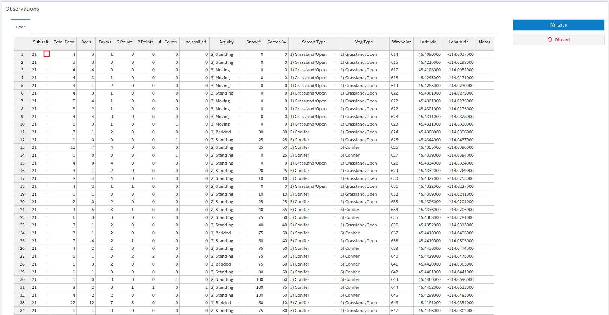

# Data Entry {#de}

This tool handles/organizes the information that makes all of the other tools work. More specifically, the data entry tool allows you to design sightability and composition surveys for a [<b>DAU</b>](#gl-dau){style="color: #086e04;"} and then enter/upload the results to the speedgoat database. Remember that the surveys you create and edit are the same ones that everyone on your team has access to, so any edit you make will change the data that EVERYONE is using for analysis.

## Walkthrough {#de-walk}

The data entry tool can be broken into two sections: creating a survey and then filling it with data.

### Creating a Survey {#de-create}

You can use the data entry tab to design aerial surveys and then populate them with data, which can then be used to inform our survival, sightability, and IPM tools. 

To begin designing a survey click the Survey Design tab. 

When you click the page, a popup window labeled Survey Design Setup should appear, prompting you for your survey [<b>species</b>](#gl-species){style="color: #086e04;"}, [<b>DAU</b>](#gl-dau){style="color: #086e04;"}, survey type ([<b>composition</b>](#gl-comp){style="color: #086e04;"} or [<b>sightability-abundance</b>](#gl-sightabundance){style="color: #086e04;"})), and survey [<b>year</b>](#gl-year){style="color: #086e04;"}. 

If this window does not pop up click the gear icon on the bottom left of the page and select [<b>Setup Wizard</b>]{style="color: #196eb0;"}. 

Once you have made your choices, a second window will appear asking you whether you would like to import strata from a past survey or start from scratch.

Either way, clicking [<b>Finish</b>]{style="color: #196eb0;"} on this second window will close the popup and leave you with a map and a table. The map and the table both act as options to assign subunits to different strata, which is the next step in the process. 

To use the map, choose which [<b>strata</b>](#gl-stratum){style="color: #086e04;"} you would like to assign to the subunits with the small window labeled Click Subunit to Assign to: and then once your strata is selected, all subunits you click on the map will be assigned to that strata. 

You can also assign subunits to different strata by using the table to manually change the [<b>Stratum</b>](#gl-stratum){style="color: #086e04;"} column from Other to whichever is appropriate for your experiment. Note that any subunit left in the Other strata will not be sampled. 

After you have selected the subunits you plan to fly, click [<b>Sample Subunits</b>]{style="color: #196eb0;"} to decide the time to fly each subunit, the proportion of the High strata that will be sampled, and whether you will sample randomly or using [<b>GRTS</b>](#gl-grts){style="color: #086e04;"}.

When you are satisfied with the survey you have designed, Click [<b>Save Survey</b>]{style="color: #196eb0;"} to save your edits.

When your survey is actually flown, return to the survey and check the Surveyed box to signal which subunits (of the units selected to be part of the survey earlier) have actually been flown. Click [<b>Save Survey</b>]{style="color: #196eb0;"} to save your edits.

### Populating the Survey {#de-popul}

Now that you have generated at least one survey, it is time to learn about the Mule Deer Composition, Mule Deer Abundance, and Elk Surveys tabs under the Data Entry dropdown, which are all used to populate surveys created in the Survey Design tab. 

It is important to understand that data added here will modify the surveys for <b>everyone</b>, so make sure you are comfortable with this information being used for analysis if you add it here. 

All three of these tools use the same framework for data entry. To make sure you’re adding info to the right survey you can either enter the relevant info in the upper window or use [<b>click here</b>]{style="color: #196eb0;"} the top of the page, which allows you to hunt for your survey manually. 

When you have selected your survey, you can add data manually one entry at a time, which is done by clicking any of the dropdown arrows in the cells of the Observations table. If you already have a spreadsheet prepared, you can also copy and paste that information right into the table. 

While you make these edits, the area that normally displays [<b>Add GPS Data</b>]{style="color: #196eb0;"} and [<b>Totals</b>]{style="color: #196eb0;"} changes to [<b>Save</b>]{style="color: #196eb0;"} and [<b>Discard</b>]{style="color: #196eb0;"}. Either accept your changes and save them to your database with [<b>Save</b>]{style="color: #196eb0;"} or revert any changes with [<b>Discard</b>]{style="color: #196eb0;"} and the original options will reappear.

You can add latitude and longitude information to the database with [<b>Add GPS Data</b>]{style="color: #196eb0;"} on the right side of the page, which will be visible as long as you do not have any unsaved edits to your Observations table. Follow the instructions of the popup window that appears for final import instructions.

When you are finished, make sure you click [<b>Save</b>]{style="color: #196eb0;"} to make your changes permanent. [<b>Attached Files</b>]{style="color: #196eb0;"} allows you to add files like maps and raw data for future reference and redundancy.

## Reference {#de-ref}

### Survey Design {#de-surdes}

Though someone with intimate knowledge of an area can bring a survey team to an area where there are a relatively high abundance of deer, surveys that return very low abundance are important as well in order to fully inform the model. The model assumes density to be constant, so if you only fly subunits where you know there are a lot of animals, that amount of animals will be extrapolated to your entire [<b>DAU</b>](#gl-dau){style="color: #086e04;"} and can lead to overestimation, since it is now represented by only its busiest areas. If you want to track how many subunits are going to be included in your analysis, click [<b>Survey Details</b>]{style="color: #196eb0;"} below the subunit selector table. This menu will remind you of your model settings while showing how many subunits have been selected for survey and how many have actually been surveyed. 

Make sure you stick to your predetermined selections if you want the model to return relevant information, since it is expecting data from these areas and these and these areas only. If the survey design menu does not pop up when you open the tool, then click the gear button on the bottom left of the page and select Setup Wizard from the options in the popup menu. 

### Mule Deer Composition {#de-mdcomp}

This software can only use data from aerial surveys. There is an option to select the aircraft that was flown for the survey which is considered for elk sightability surveys but NOT mule deer surveys, so it’s best to just leave that box as “Nothing Selected”. You can either begin entering survey data manually in the window labelled New, which will begin adding your data to a new survey, or you can edit surveys that you have already created with the link above the table labeled “click here”. The Attached Files button Allows you to add files that you would like to be kept with your observations such as a reference map.

The Observations window allows you to view and alter your data. The Add GPS Data button on the right side of the window allows you to easily import latitude and longitude from .csv files, and the Totals button brings up a window summarizing your data.

### Mule deer Abundance {#de-mdabun}

This software can only use data from aerial surveys. There is an option to select the aircraft that was flown for the survey which is considered for elk sightability surveys but NOT mule deer surveys, so it’s best to just leave that box as “Nothing Selected”. You can either begin entering survey data manually in the window labelled New, which will begin adding your data to a new survey, or you can edit surveys that you have already created with the link above the table labeled “click here”. The Attached Files button Allows you to add files that you would like to be kept with your observations such as a reference map.

The Observations window allows you to view and alter your data. The Add GPS Data button on the right side of the window allows you to easily import latitude and longitude from .csv files, and the Totals button brings up a window summarizing your data.

### Elk Surveys {#de-esurv}

Like the mule deer survey tools, this software can only use data from aerial surveys. Elk sightability models are different than the mule deer ones since they incorporate the make of the survey plane in the model. Either enter data from your survey directly to begin adding data to a new survey or by clicking the “Click Here” under the page header. The Attached Files button Allows you to add files that you would like to be kept with your observations such as a reference map.

The Observations window allows you to view and alter your data. The Add GPS Data button on the right side of the window allows you to easily import latitude and longitude from .csv files, and the Totals button brings up a window summarizing your data.

### Summary {#de-summ}

Be aware that the surveys displayed in the table when you first open the tool are not all of the data available, use the page navigation at the bottom right of the window to see more. If you are looking for a particular survey or location, the blank boxes at the top of every column can be used to search all entries. Just type something in the box and it will automatically find entries in the column that match what you type. This section is great for reviewing/checking raw data since you can download any of the survey data as a .csv.
