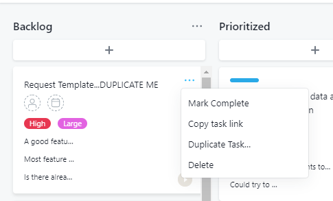
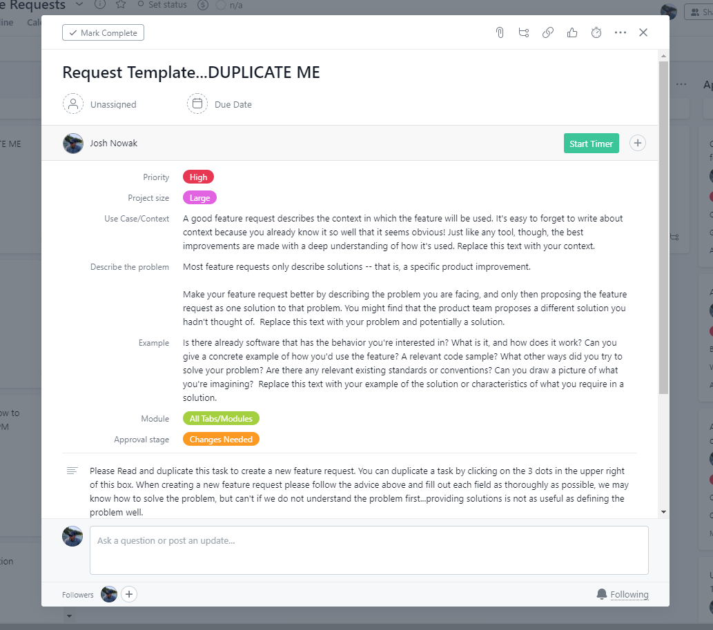
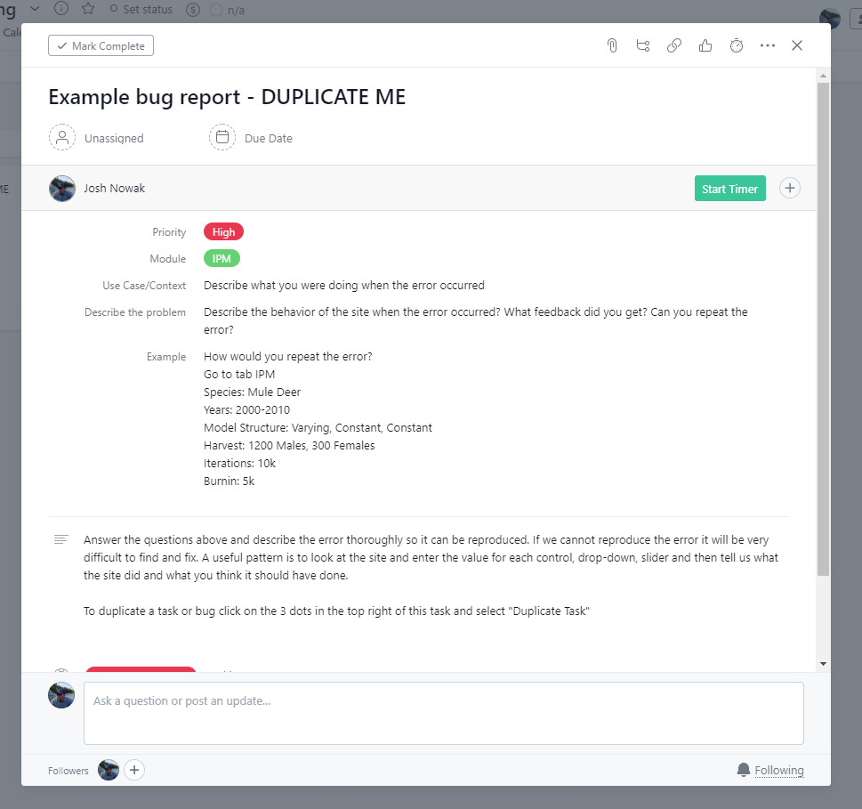

  

# Project Management

At SpeedGoat we want to work with our collaborators. One of our biggest challenges is understand the dynamic schedules and needs of our collaborators. To this end, we have invested in managing our projects transparently in [Asana](https://asana.com/product). Our goal here is to help increase transparency, communication and organization related to projects.

## Short Version

- Each agency/collaborator is a Team, Team's have Projects, Projects have Tasks, Tasks tell us when and what work to do
- Tasks can be prioritized by position, tags, due dates and comments, please change
- Create tasks by duplicating template tasks in project boards (e.g. Feature Requests)
- Fill out tasks by following template instructions
- You will invite your team to the board, not us
- The boards are private
- Have an idea, create a feature request
- Have a problem, create a bug report

### Teams

Our collaborations are first organized by *Teams*, which typically reference an agency or entity. For example, there is a team for everyone from Idaho and another for folks from South Dakota. Within each team we will create *Projects*.

### Projects

Projects come in two forms, those with definitive start and end dates and those that are persistent. Specific contracts to build a model or some workflow are good examples of a project with definitive start and end dates. On the other hand, each team always has at least two persistent projects named *Feature Requests* and *Bug Tracking*, described in more detail below. Clicking on a project will expose the board related to that topic or work. Within this page the user will see a series of tabs at the top of the screen. The Board view is our favorite, here you will find columns such as To Do, Backlog, Prioritized, In Progress, and Done. These columns provide a quick visual check of the state of tasks within the project.

### Tasks

A task is a self contained unit of requested work. Each task is represented as a card on the Board view and these cards can be moved around the board by clicking and dragging. This is where our collaborators play a key role, we want participation and encourage folks to move cards, set due dates and leave comments within each task to help keep everything on track. We are not asking for you to manage our projects, we are asking for participation in the planning process so we can meet your needs. To create a new task users should first find the *Template* task, which is usually at the top left of the board. Placing your mouse over this card will cause three dots to appear and clicking on those dots will provide options including the ability to duplicate a task. The image below gives you an idea of what it will look like in the board:

  

We encourage users to duplicate a template because the templates have text and fields that are necessary for us to understand the feature, bug, or task. For a complete how to on tasks please click on [this link](https://asana.com/guide/get-started/begin/adding-assigning-tasks). You can't really break anything, so feel free to try it out click on some things and create a task or two.

## Feature Requests

Your board will always have a Feature Requests project. This is the place for inspiration, new ideas, discussion and planning new features, analyses or other cool ideas that you have. Need a new report, want more data checks or want a new plot then create a feature request. Feature requests are not special except they typically represent small changes to software or analyses and do not require new contracts or months of work. Regardless of the size of the idea we suspect that most large projects will begin life as a feature request. When creating a feature request it is important to duplicate the template in the Backlog column. The template contains a lot of information to help you put your desires in terms we can understand and act on. We often get told how to do, but more often we need to be told what and why. The feature request template task is shown below: 

  

When creating a task please take the time to read the text and then replace it with your reponse. Aside form the text please notice the tags such as priority and module. At the top of the task you can also propose a *Due Date* to help us understand not only the priority, but the timeline required.

## Bug Tracking

The *Bug Tracking* board provides a place to discuss unexpected software behavior. A bug is anytime the software does something unexpected, fails outright or does not otherwise produce the desired result. To fix a bug we need to understand not only what happened, but how the bug was produced and ideally we would be able to reproduce the error. If we can reproduce the error we can generally fix it in short order, but if we can't make the error happen there isn't much we can do. To help us better understand the bug you have detected please try to duplicate the bug template task shown below, read the text and replace the text with your thoughts.

  

It should be clear after comparing the bug report to a feature request that very different information is required in each scenario and these templates attempt to help guide your through this process. 

## Permissions

Our Asana boards are private to those individuals involved in a contract/relationship. We do not invite people to your board, you do. You can expect that members of the SpeedGoat team have access to your board and then one or two individuals are generally invited to the board from the agency. At this point board members can invite new people to the board. It is worth noting that access is not to all Projects within a Team by default. Team members can invite other team members or invite individuals to one project at a time. A detailed explanation of [team permissions can be found here](https://asana.com/guide/help/organizations/members).

## Deep Dive

The help documentation for Asana can be found at [https://asana.com/guide](https://asana.com/guide).

 

Speedgoat Website: [www.speedgoat.io](https://www.speedgoat.io)

***

 

