 

# Weighted Surveillance

 

## Introduction

This application provides tools for planning weighted surveillance sampling for chronic wasting disease (CWD), and estimating underlying prevelance after sampling has been completed. At the moment the tools focus on white-tailed deer (*Odocoileus virginianus*) populations, but other species and tools are under development.

Weighted surveillance is based on the simple principle that within a population there exists heterogeneity among individuals with regard to disease risk. To maximize efficiency and potentially increase the likelihood of detecting new disease foci, weighted surveillance programs exploit this heterogeneity by focusing disease detection efforts in groups most at risk. The underlying methods were orginially developed by [Walsh et al. (2010)](http://www.bioone.org/doi/pdf/10.7589/0090-3558-46.1.118) using a Frequentist statistical approach. These results were then refined and recast into a Bayesian statistical framework by [Heisey et al. (2014)](http://journals.plos.org/plosone/article?id=10.1371/journal.pone.0089843). It is imporant to note that the use of weighted surveillance techniques requires that prior information is available to estimate heterogeneity in individual risk. A general discussion of CWD surveillance is given in [Walsh et al. (2012)](https://pubs.usgs.gov/of/2012/1036/pdf/ofr2012_1036.pdf).

The first tool called **Design**, is used for planning weighted surveillance activities. The user specifies how much confidence they need, and what minimum prevalence they would like to detect in yearling males (e.g., I would like a 95% confidence of detecting at least one case if the prevalence is at least 1%). This information then provides the total number of points required to meet the specified confidence for the chosen minimum prevalence. The user can then select from the potential sources of surveillance samples, and vary the number of samples arising from each source. This provides a means of setting sampling objectives for each source to ensure the requisite number of points is reached. This tool can also be used to evaluate in real-time how close a program is to achieving its goal given the number of samples collected from each source to date.

The second tool called **Estimation** is for use after sampling for CWD detection has occurred and no positive cases were found. It provides the means to estimate the potential underlying prevalence rate of CWD given the number of negative samples collected during surveillance. Of particular interest is the upper bound of the credible interval, which means there is, for example, a 95% probability that true prevalence is at or below the reported level given your sampling effort and lack of cases detected.

It's important to note that these tools are entirely independent - you can use either one however you wish but there's no need to use both, and changes made in one tool won't have any affect in the other.

The techniques and theory underpinning them used in this application are described in [Heisey et al. (2014)](http://journals.plos.org/plosone/article?id=10.1371/journal.pone.0089843). This application takes advantage of the [R](https://www.R-project.org/) statistical software for estimation. Heterogeneity of risk classes are based on the chronic wasting disease information collected by the [Wisconsin Department of Natural Resources](https://dnr.wi.gov/topic/wildlifehabitat/regulations.html). [Jennelle et al. 2018](https://besjournals.onlinelibrary.wiley.com/doi/abs/10.1111/1365-2664.13178) provide a description of the Wisconsin estimates and provide a case study of the application of weighted surveillance to CWD detection.

 

## Help

Blue question marks in the various sections of the app link directly to the relevant sections of this document. If you have trouble with the site or have questions that aren't covered here you can contact Josh, the site's maintainer, by clicking on the lifering in the top-right of your screen. You can also issue a *bug report* by clicking on the bug icon in the header. Finally, if you have an idea for a new feature or analysis please let us know by clicking on the lightbulb icon and issuing a *feature request*. The help icons are shown in the image below:

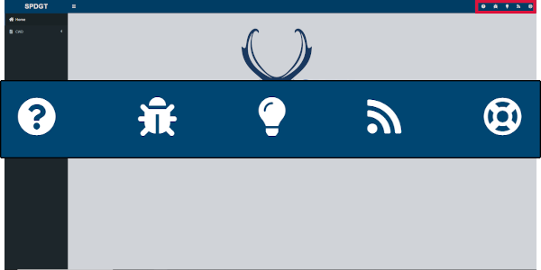

 
 

## Design Tool

The **Design** tool is used for planning weighted surveillance activities. If you've already collected your samples and just want to analyze the results you can skip the design tab and go straight to the [estimation tab](#estimation-tab).  

To begin using the **Design** tool click on CWD and then Design in the sidebar.

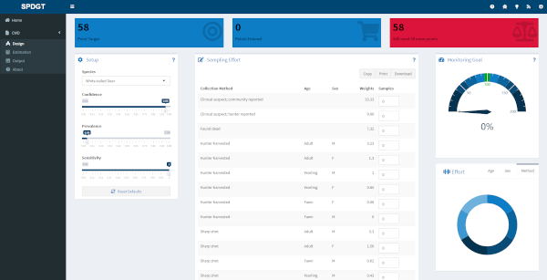

 

### Design Setup

The setup pane on the Design tab allows you to specify the monitoring goals of your surveillance program. It includes three sliders which can be used to set target sampling effort based on the desired outcome.

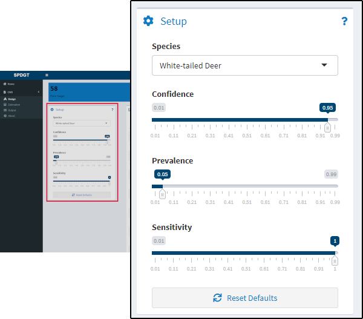

Hunter-harvested yearling males are used as the reference class throughout the site (see [Points](#points)), and the selections you make in the Setup pane will be applied to that class. The slider functions are as follows:

1) Confidence - Use this slider to set the confidence you desire for detecting at least one case given the selected prevalence. The confidence level can also be thought of as 1 - alpha.
2) Prevalence - Use this slider to set the minimum target prevalence for which you would like the specified confidence of detecting at least one case.
3) Sensitivity - The last slider is used to specify the diagnostic test sensitivity, which is typically assumed to be 1 unless live-testing is conducted.

For example, using the default values the target points will be based on having a 95% confidence of detecting at least one case given a latent prevalence of 0.05 in hunter-harvested yearling males.

 

### Points

While moving the sliders in the input pane you should notice that the value displayed in the *Target Points* box at the top of the screen changes.

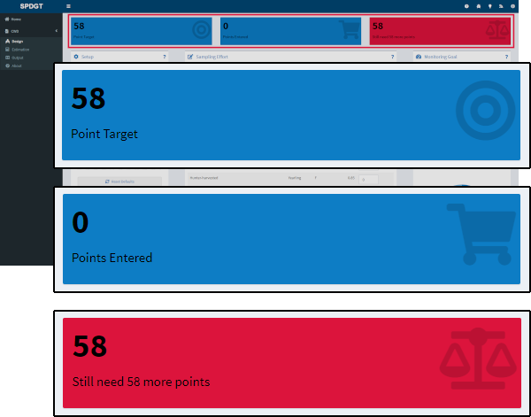

The *Target Points* value represents the number of samples you would need to collect from the reference class (hunter-harvested yearling males) in order to achieve the goals you set in the input tab. Using the defaults in the setup pane, for example, you would need 58 samples from hunter-harvested yearling males to achieve 95% confidence of detection given a prevalence rate of 0.05.  

Samples from other classes are weighted differently in the model and therefore will contribute more or less to hitting your target.

 

### Effort Data Entry

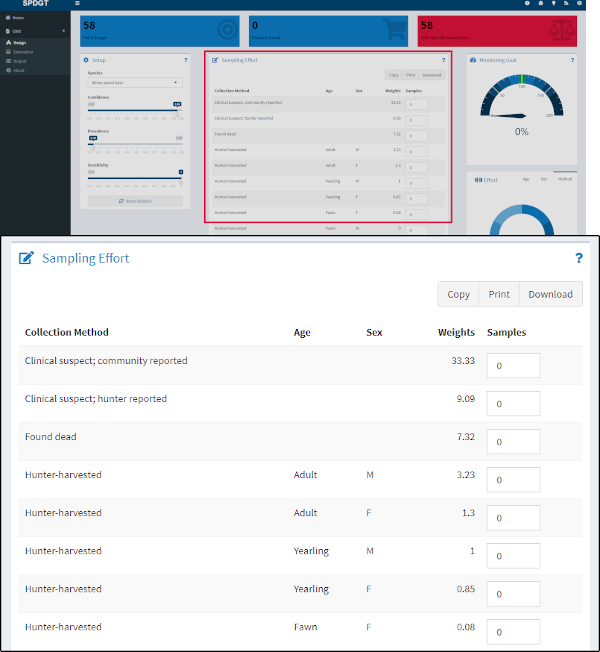

The *Sampling Effort* table displays the Collection Method, Age and Sex of classes available in the model, along with the weights (relative to the reference class) assigned to each class. Enter the number of samples you propose to collect for each class in the last column and the *Points Entered* and *Points Remaining* boxes at the top of the screen will update. Along with the gauge widget on the right side, these boxes reflect how the sampling effort you've entered relates to your monitoring target. You can also explore how the different collection methods and demographic groups contribute to achieving your monitoring target using the donut charts at the bottom right of the page.

 
 

## Estimation Tool

The **Estimation** tool is used to estimate the potential underlying prevalence rate of CWD after sampling has occurred and no positive cases were found.

To begin using the **Estimation** tool click on CWD and then Estimation in the sidebar.

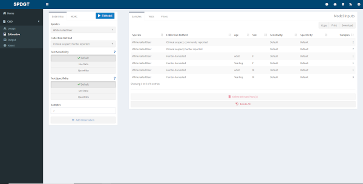

 

### Sampling Data Entry

Use the pane on the left side to enter information about the samples you collected.

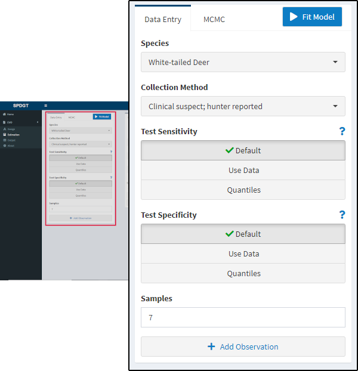

First select the species and collection method near the top. Depending on the collection method additional options regarding age and sex of subjects may become available. Then select the appropriate options for your test characteristics - described in more detail [below](#test-characteristics). Finally enter the number of samples you collected for the given collection method and click the *Add Observation* button to add these samples to your dataset.

Data you add through these inputs will appear in the *Samples* table in the main pane. If you make a mistake or change your mind you can select one or more rows in the table and use the *Delete Selected Rows* button to remove them from the dataset, or you can *Delete All Rows* to start over.

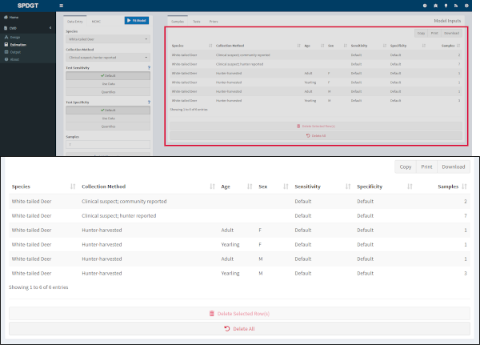

 

### Test Characteristics

The following methods are available for generating a posterior distibution for the test characteristics.

1. The 'Default' method uses the posterior distributions of the sensitivity and specificity based on the results in Vet Rec 151:610-612 for IHC on retropharyngeal lymph nodes and a Jeffreys prior (i.e., mean sensitiviy = 98.6% and mean specificity >99%).

2. The 'Use data' method allows the user to specify their results for each test, and requires the number of true and false positives and negatives. The posterior distributions for the test characteristics are then  estimated using a Jeffreys prior.

3. The 'Quantile' method allows the user to specify the mean and 95% credible bounds for the posterior distribution of the test characteristics. These are used to generate a suitable Beta distribution.

Test characteristics apply can vary by collection method, age, and sex if needed, e.g. in cases where different tests are used depending on the collection method or when test characteristics vary based on the age or sex of the subject.

You can preview the distributions created based on your inputs by clicking the *Tests* tab above the main panel.

 

### MCMC

You can adjust model settings using the *MCMC* tab in the data entry section. Number of chains, burn-in length, and model iterations can all be adjusted if needed.

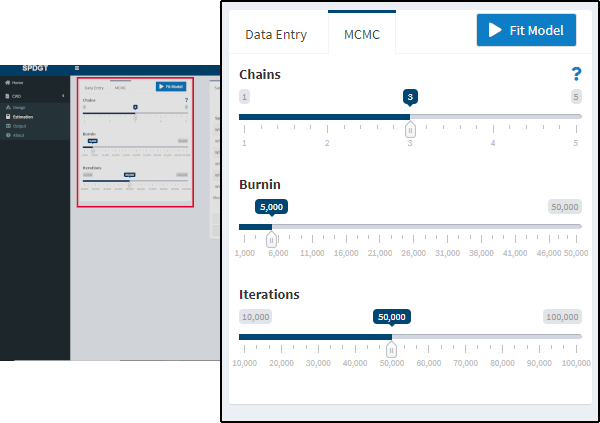

 

### Priors

As of writing the priors available to the model are fixed and cannot be manipulated by the user. Data are based on chronic wasting disease information collected by the [Wisconsin Department of Natural Resources](https://dnr.wi.gov/topic/wildlifehabitat/regulations.html). You can view the data by clicking the *Priors* tab in the main panel.

 

### Running the model

When you've entered the appropriate information for each group of samples collected, checked that everything looks right in the *Samples* table, and adjusted the model settings in the *MCMC* tab if needed, click the *Fit Model* button (top of the left pane) to fit a model for your data. After a short time you'll be prompted with a message letting you know if the model run was successful. If so a new *Output* tab will appear in the sidebar where you can view your results.

 
 

## Output Tab

The *Output* tab is only available after you've entered data in the [Estimation tab](estimation-tool) and clicked the button to fit a model.

 

### Estimates Table

The estimates table displays model outputs (estimated latent prevalence) for all classes (Collection Method/Age/Sex) in a single table. Mean, median, standard deviation, and confidence intervals (90% and 95%) are reported for each class.

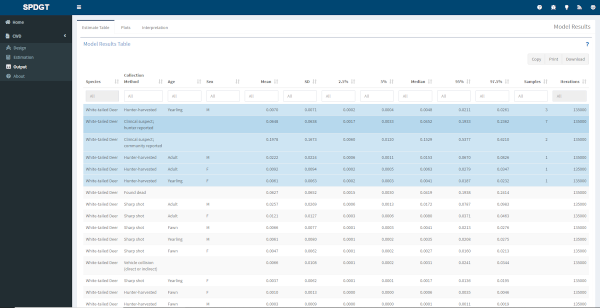

 

### Output Plots

The plots page shows a probability density plot for estimated latent prevalence of CWD by class, along with a trace plot for diagnosing model performance. Change the data displayed in either plot by using the dropdown below the plot to select a different class.

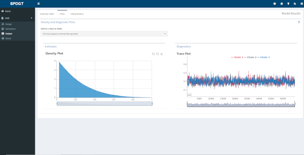

 

### Interpretation

The interpretation page provides some guidance for explaining the model output with regard to your actual population. By default the reference class (hunter-harvested yearling males) is displayed, but you can also view an interpretation for a different class by changing the selection in the dropdown near the top of the page.

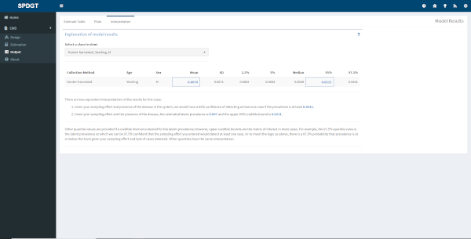

 
 

## Suggestions

If you have suggestions or corrections that you would like to propose to this document please either file a bug report at [this link](https://github.com/SpeedGoat/DiseaseMonitoring) or make a contribution and issue a pull request via the [Huh/Help_Pages](https://github.com/SpeedGoat/Help_Pages) GitHub repository.

***

Developed by Josh Nowak, [SpeedGoat](https://www.speedgoat.io)

 

***

 

