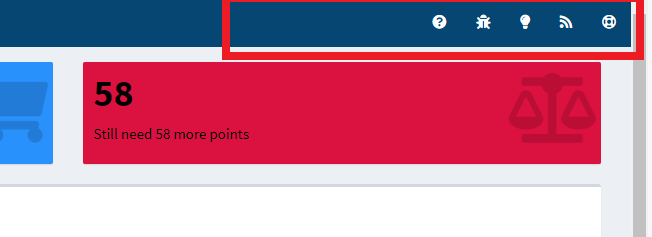
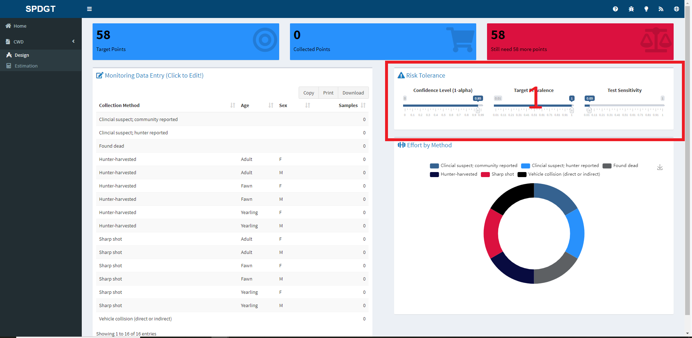
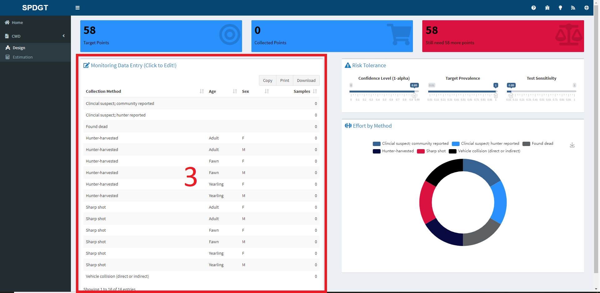

 
 

## Chronic Wasting Disease Weighted Surveillance

This application provides an easy-to-use interface for conducting weighted surveillance for chronic wasting disease (CWD). At the moment the tools focus on white-tailed deer _Odocoileus virginianus_ populations, but other species and tools are under development. Weighted surveillance is based on the simple principle that within a population there exists heterogeneity among individuals with regard to disease risk. To maximize efficiency and potentially increase the likelihood of detecting new disease foci, weighted surveillance programs exploit this heterogeneity by focusing disease detection efforts in groups most at risk. The underlying methods were orginially developed by [Walsh et al. (2010)](http://www.bioone.org/doi/pdf/10.7589/0090-3558-46.1.118) using a Frequentist statistical approach. These results were then refined and recast into a Bayesian statistical framework by [Heisey et al. (2014)](http://journals.plos.org/plosone/article?id=10.1371/journal.pone.0089843). It is imporant to note that the use of weighted surveillance techniques requires that prior information is available to estimate heterogeneity in individual risk. A general discussion of CWD surveillance is given in [Walsh et al. (2012)](https://pubs.usgs.gov/of/2012/1036/pdf/ofr2012_1036.pdf).

This application provides tools for planning sampling and estimating underlying prevelance after sampling has been completed. Each tool is represented by a tab at left in the dashboard and can be accessed by clicking on the CWD tab. 

The first tool called **Design**, is used for planning weighted surveillance activities. The user specifies how much confidence they need, and what minimum prevalence they would like to detect in yearling males (e.g., I would like a 95% confidence of detecting at least one case if the prevalence is at least 1%). This information then provides the total number of points required to meet the specified confidence for the chosen minimum prevalence. The user can then select from the potential sources of surveillance samples, and vary the number of samples arising from each source. This provides a means of setting sampling objectives for each source to ensure the requiste number of points is reached. This tool can also be used to evaluate in real-time how close a program is to achieving its goal given the number of samples collected from each source to date. 

The second tool called **Estimation** is for use after sampling for CWD detection has occurred and no positive cases were found. It provides the means to estimate the potential underlying prevalence rate of CWD given the amount of samples collected during surveillance. Of particular interest is the upper bound of the credible interval. If the disease is present in the system, it provides the prevalence rate for which there is, for example, a 95% probability the true prevalence is below. 

The techniques and theory underpinning them used in this application are described in [Heisey et al. (2014)](http://journals.plos.org/plosone/article?id=10.1371/journal.pone.0089843). This application takes advantage of the [R](https://www.R-project.org/) statistical software for estimation. Heterogeneity of risk classes are based on the chronic wasting disease information collected by the [Wisconsin Department of Nautral Resources](https://dnr.wi.gov/topic/wildlifehabitat/regulations.html). [Jennelle et al. 2018](https://besjournals.onlinelibrary.wiley.com/doi/abs/10.1111/1365-2664.13178) provide a description of the Wisconsin estimates and provide a case study of the application of weighted surveillance to CWD detection.

## Help

Every input a user can manipulate and every title/heading has a corresponding popup or tooltip that can be accessed by hovering your mouse over the desired element. If you have trouble with the site and would like to ask for help you can contact Josh, the site's maintainer, by clicking on the lifering in the top-right of your screen. If you ever have a problem with the site you can issue a *bug report* by clicking on the bug icon in the header. Finally, if you have an idea for a new feature or analysis please let us know by clicking on the lightbulb icon and issuing a *feature request*. The help icons are shown in the image below:

*This website has documentation that suggests you should issue bug requests through Asana for our projects, but for opensource projects we track bug reports and feature requests using GitHub.*

## Design Tab

To begin using the Design tool click on CWD and then Design, which will cause the application page to appear. You should now see this page:

In the page above you can see a red box with the number 1 in the middle of it. This box highlights three sliders that are used to set the target number of points for the surveillance, which as the box title suggests implies a risk tolerance. The slider functions are as follows:

1) Confidence - Use this slider to set the confidence you desire for detecting at least one case if the prevalence is equal to 0.05 in the harvested yearling males. The confidence level can also be thought of as 1 - alpha.
2) Prevalence - This slider is used to specify the minimum target prevalence in harvested yearling males for which you would like a 0.95 confidence of detecting at least one case.
3) Sensitivity - The last slider is used to specify the dianostic test sensitivity, which is typically assumed to be 1 unless live-testing is conducted.

While moving the sliders you should notice that the value displayed in the *Target Points* box at the top of the screen keeps adjusting. This box is shown in this image:

The values in the boxes highlighted in the above image will update according the user inputs. When moving the sliders the *Target Points* value will adjust and when entering values in the table the *Collected Points* and *Difference* boxes will update.

Once the user is happy with their risk level they can move to the *Monitoring Data Entry* table. 

This table reflects the Collection Method, Age and Sex of data used to create priors for the species of interest. While users cannot edit the first three columns of the table it is critical that the Samples column is edited to reflect the desired sampling method(s) and effort. To edit the table, double-click on the cell you wish to edit, enter the number of animals you propose to sample and then press Enter to submit your entry. When the Sample column is edited the Collected Points value box at the top of the page will update along with the top-right box, which will let the user know how many more points are required. Similarly, the pie chart will update to give the user a sense of distribution of effort by method.

## Suggestions

If you have suggestions or corrections that you would like to propose to this document please either file a bug report at [this link](https://github.com/SpeedGoat/DiseaseMonitoring) or make a contribution and issue a pull request via the [Huh/Help_Pages](https://github.com/SpeedGoat/Help_Pages) GitHub repository.

***

Developed by Josh Nowak, [SpeedGoat](https://www.speedgoat.io)

 

***

 

