 

# Weighted Surveillance

 

## Introduction

This application provides tools for planning weighted surveillance sampling for
*Pseudogymnoascus destructans* (Pd), the fungal agent that causes white-nose syndrome in
bats, and estimating underlying prevalence after sampling has been completed.

Weighted surveillance is based on the simple principle that within a population there exists
heterogeneity among individuals with regards to disease risk. To maximize efficiency and
potentially increase the likelihood of detecting new disease foci, weighted surveillance programs
exploit this heterogeneity by focusing disease detection efforts in groups most at risk. The
underlying methods were originally developed by [Walsh et al. (2010)](https://cpw.state.co.us/Documents/Research/WildlifeHealth/Publications/WeightedSurveillanceApproachCWD.pdf) using a Frequentist statistical approach. These results were then refined and recast into a Bayesian statistical framework by [Heisey et al. (2014)](http://journals.plos.org/plosone/article?id=10.1371/journal.pone.0089843). It is important to note that the use of weighted surveillance techniques requires that prior information is available to estimate heterogeneity in individual risk and is only useful for disease detection. A general discussion of weighted surveillance is given in [Walsh et al. (2012)](https://pubs.usgs.gov/of/2012/1036/pdf/ofr2012_1036.pdf). When applying weighted surveillance techniques to Pd detection, the methods were modified to permit each sample type to have different diagnostic test sensitivities.

The first tool called **Design**, is used for planning weighted surveillance activities. The user
specifies how much confidence they need, the sensitivity of the diagnostic test in the base-line
class (i.e., the sample type defined by the user against which all other sample types in the
surveillance stream are scaled – in this application the base-line class are winter skin swabs
from *Myotis spp.* and *Perimyotis subflavus*), and what minimum prevalence they would like to
detect in the reference class (e.g., I would like a 95% confidence of detecting at least one case
if the prevalence is at least 1%). This information then provides the total number of points
required to meet the specified confidence for the chosen minimum prevalence. The user can
then select from the potential sources of surveillance samples and vary the number of samples
arising from each source. This provides a means of setting sampling objectives for each source
to ensure the requisite number of points is reached. This tool can also be used to evaluate in
real-time how close a program is to achieving its goal given the number of samples collected
from each source to date.

The second tool called **Estimation** is for use after sampling for Pd detection has occurred and
no positive cases were found. It provides the means to estimate the potential underlying
prevalence rate of Pd given the number of negative samples collected during surveillance. Of
particular interest is the upper bound of the 95% credible interval, which is the prevalence level
for which there is 95% probability that true prevalence is at or below, given your sampling effort
and lack of cases detected.

It’s important to note that these tools are entirely independent - you can use either one however
you wish but there’s no need to use both, and changes made in one tool won’t have any affect
in the other.

The techniques and theory underpinning them used in this application are described in [Heisey et al. (2014)](http://journals.plos.org/plosone/article?id=10.1371/journal.pone.0089843). This application takes advantage of the [R](https://www.R-project.org/) statistical software for estimation. Heterogeneity of risk classes are based on the chronic wasting disease information described in [Jennelle et al. (2018)](https://besjournals.onlinelibrary.wiley.com/doi/abs/10.1111/1365-2664.13178) and [Walsh et al. (2012)](https://pubs.usgs.gov/of/2012/1036/pdf/ofr2012_1036.pdf).  The former provides a description of the Wisconsin estimates and a recent case study of the application of weighted surveillance to WNS detection. The elk and mule deer weights are based on results reported in [Walsh et al. (2012)](https://pubs.usgs.gov/of/2012/1036/pdf/ofr2012_1036.pdf).

 

## Help

The toolbar at the top-right of your screen has links to [help pages](https://speedgoat.github.io/Help_Pages/cwd.html), [bug tracking](https://github.com/SpeedGoat/DiseaseMonitoring), contact information and more.

 
 

## Design Tool

The **Design** tool is used for planning weighted surveillance activities. If you've already collected your samples and just want to analyze the results you can skip the design tab and go straight to the [Estimation tool](#estimation-tool).  

To begin using the **Design** tool click on WNS and then Design in the sidebar.

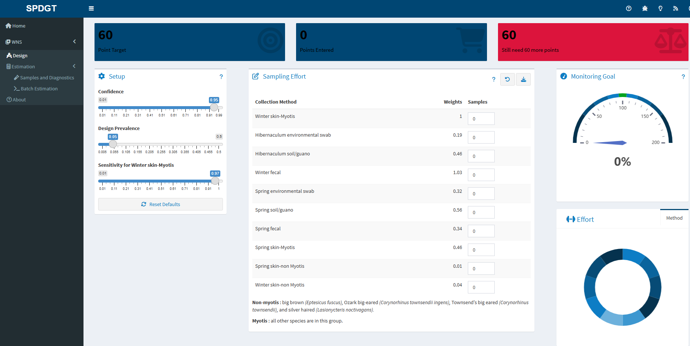

 

### Design Setup

The setup pane on the Design tab allows you to specify the monitoring goals of your surveillance program. It includes three sliders which can be used to set target sampling effort based on the desired outcome.

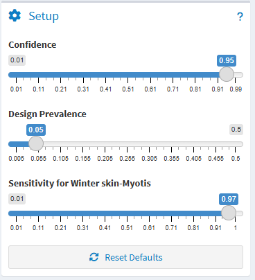

1) Confidence - Use this slider to set the confidence you desire for detecting at least one case given the selected prevalence. The confidence level can also be thought of as 1 - alpha.
2) Design Prevalence - Use this slider to set the minimum target prevalence for which you would like the specified confidence of detecting at least one case in the reference class (see [Points](#points)).
3) Sensitivity for Winter skin-Myotis - The last slider is used to specify the diagnostic test sensitivity, which is typically assumed to be 1 unless live-testing is conducted.

For example, using the default values, the target points will be based on having a 95% confidence of detecting at least one case given a latent prevalence of 0.05.

 

### Points

While moving the sliders in the input pane you should notice that the value displayed in the *Target Points* box at the top of the screen changes.

The *Target Points* value represents the number of samples you would need to collect from the reference class in order to achieve the goals you set in the input tab. Given the example above, you would need 60 samples to achieve 95% confidence of detection given a prevalence rate of 0.05. Samples from the reference class are always assigned a weight of 1. Samples from other classes are assigned different weights relative to the reference class and therefore will contribute more or less to hitting your target.

 

### Effort Data Entry

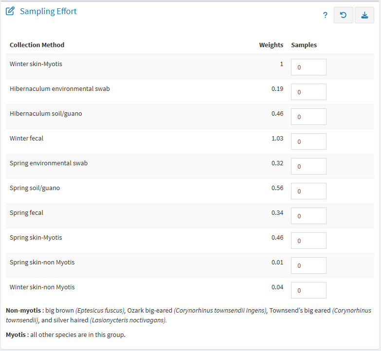

The *Sampling Effort* table displays the Collection Method along with the weights (relative to the reference class) assigned to each class. Enter the number of samples you propose to collect for each class in the last column and the *Points Entered* and *Points Remaining* boxes at the top of the screen will update. Along with the gauge widget on the right side, these boxes reflect how the sampling effort you've entered relates to your monitoring target. You can also explore how the different collection methods contribute to achieving your monitoring target using the donut charts at the bottom right of the page.

 
 

## Estimation Tool

The **Estimation** tool is used to estimate the potential underlying prevalence rate of WNS after sampling has occurred and no positive cases were found.

To begin using the **Estimation** tool click on WNS and then Estimation in the sidebar. Then click on *Samples and Diagnostics*.

 

### Samples and Diagnostics

The *Samples and Diagnostics* tab allows you to set different collection methods and number of samples.

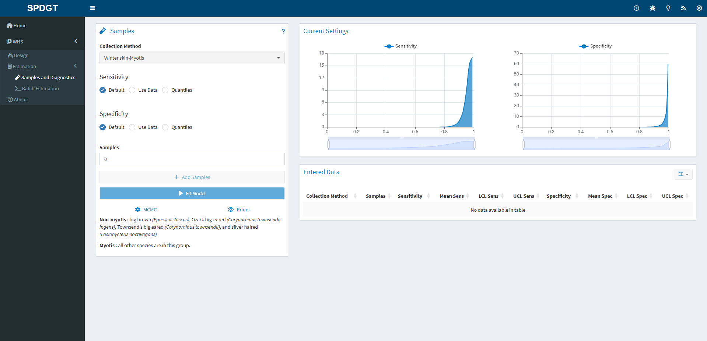

The following methods are available for generating a posterior distibution for diagnostic test characteristics.

1. The 'Default' method uses the posterior distributions of the sensitivity and specificity based on the results in Vet Rec 151:610-612 for IHC on retropharyngeal lymph nodes and a Jeffreys prior (i.e., mean sensitiviy = 98.6% and mean specificity >99%). Default values are different for each sample type.

2. The 'Use data' method allows the user to specify their results for each test, and requires the number of true and false positives and negatives. The posterior distributions for the test characteristics are then  estimated using a Jeffreys prior.

3. The 'Quantile' method allows the user to specify the mean and 95% credible bounds for the posterior distribution of the test characteristics. These are used to generate a suitable Beta distribution.

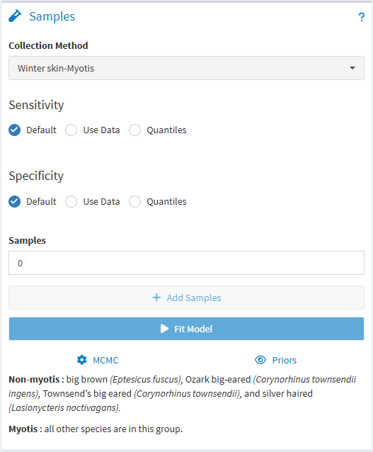

The default method has already been entered for you, so if you plan on using the default test characteristics for all your samples you can simply enter the number of samples to collect and click *Add Samples*. Data you add through these inputs will appear in the *Entered Data* table to the right. If you make a mistake or change your mind you can select one or more rows in the table and use the *Delete Selected Rows* button to remove them from the dataset, or you can *Delete All Rows* to start over.

 

### Model Settings

You can adjust model settings using the *MCMC* button at the bottom of the Samples tab. Number of chains, burn-in length, and model iterations can all be adjusted if needed.

As of writing the priors available to the models are fixed and cannot be manipulated by the user. You can view the data by clicking the *Priors* button.

 

### Running a model

When you've entered the appropriate information for each group of samples collected, checked that everything looks right in the *Samples* table, and adjusted the model settings if needed, click the *Fit Model* button to fit a model for your data. After a short time you'll be prompted with a message letting you know if the model run was successful. If so a new *Output* tab will appear in the sidebar where you can view your results.

 
 

## Output Tab

The *Output* tab is only available after you've entered data in the [Samples tab](#samples-and-diagnostics) and clicked the button to fit a model.

 

### Estimates Table

The estimates table displays model outputs (estimated latent prevalence) for all collection methods in a single table. Mean, median, standard deviation, and credible intervals (90% and 95%) are reported for each class. Rows are color coded based on the number of samples entered for each class.

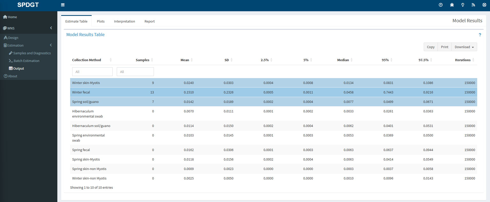

 

### Output Plots

The plots page shows a posterior distribution plot for estimated latent prevalence of WNS by class, along with diagnostic plots for assessing model performance. By default a trace plot depicting every 100th iteration is displayed, but you can change the plotting interval or switch to an autocorrelation plot using the button at the top right of the Diagnostics section.

Change the data displayed in both plots by using the dropdown above the plots to select a different class. Use the buttons and sliders within the plots to zoom in to a finer scale or save as an image file. You can also download density plots for all classes in a single click using the *Download All* button.

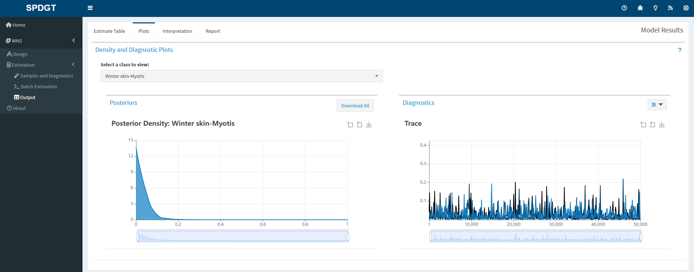

 

### Interpretation

The interpretation page provides some guidance for explaining the model output with regard to your actual population. By default the reference class is displayed, but you can also view an interpretation for a different class by changing the selection in the dropdown near the top of the page.

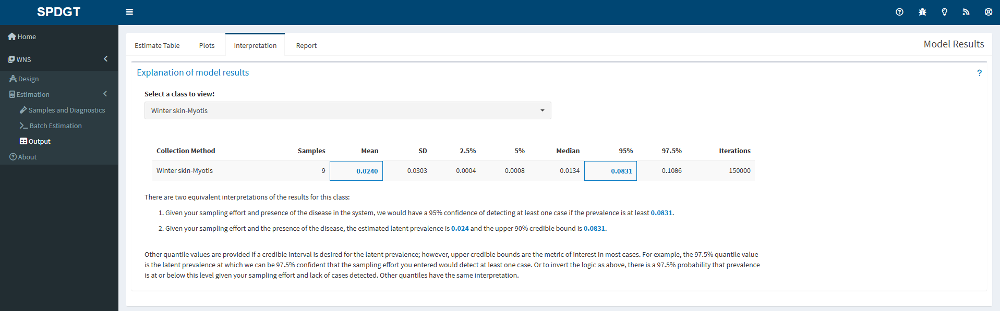

 
 

### Report

Click the *Download Report* button to generate a full report of your data. The report includes all of the test and sample data you entered, the settings used, and the output tables and plots. Reports are available in html and Microsoft Word formats.

 
 

## Batch Estimation

The batch estimation tool is designed to help users who need to estimates from many models. The tool has a friendly spreadsheet that may be downloaded by the user to enter their data and then uploaded to the site for estimation. To use batch estimation begin by clicking the *Batch Estimation* link in the sidebar. 

### Template

The first step is to download the batch estimation template. The template is a spreadsheet that can be used to enter data for multiple models. The template can be downloaded by clicking the *Download Template* link in the box titled *Upload Data*.

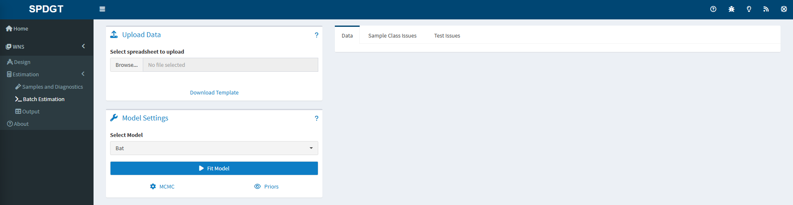

The template spreadsheet has 4 sheets: *Data*, *Priors*, *Instructions*, and *Example*. The *Data* sheet is where you will enter your data. The *Priors* sheet is where you can view the priors that will be used in the model. The *Instructions* sheet provides guidance on how to use the template. The *Example* sheet provides an example dataset.

The Data sheet has 7 columns that align with the models expectations and how other aspects of the website function. The first column *Batch* is used to group samples. Samples with the same value in the *Batch* column will be estimated together. The *Species* column is used to specify the species of the samples. The *Collection Method* column is used to specify the method used to collect the samples. The *Age* and *Sex* columns are used to specify the age and sex of animals sampled. The *Samples* column is used to specify the number of negative samples obtained for the combination of species, collection method, age, and sex. This column allows only whole numbers greater than or equal to 0. Finally the *Test* column is used to specify the diagnostic test to be used. Enter *Default* to use the default test. If a custom test is required then specify that in the website and enter the name of the test in the *Test* column exactly as it is in the website. For more information about diagnostic tests see the [Diagnostic Tests](#diagnostic-tests) section.    

Note when entering data that not all combinations of species, collection method, age, and sex are valid. If any invalid combinations are present in your data when you upload it the website will issue a warning. Those entries with invalid combinations or those entries for which no prior exists will be removed prior to running any models.

When the data are entered and all entries checked upload the spreadsheet by clicking the *Browse...* button and selecting the file from your computer. Once the file is selected click the *Open* button to upload the data. The website will check the data and issue a warning if any invalid entries are present. The data will be shown to the user under the *Data* tab, while errors will be shown under the *Sample Class Issues* and *Test Issues* tabs.

### Model Selection

After the data are uploaded the user must select the model to be used for estimation. The model can be selected by clicking the *Select Model* dropdown and selecting the desired model. The user can adjust model settings and MCMC parameters as needed. The settings are the same as those described in the [Model Settings](#model-settings) section.

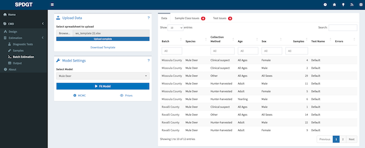

### Running a Batch Model

When satisfied that all inputs are correct click the *Fit Model* button to run the model. The website will run the model and display the results in a newly created *Output* link in the sidebar on the left. The website will also display a progress bar to show the user how far along the model is in the estimation process and notify the user of success or failure of the model runs.

### Batch Estimation Output

After the model has run the website will display a results table and report generation option in the *Output* tab located in the sidebar on the left. Users are encouraged to download the results as a report by navigating to the Reports tab at the top of their screen and clicking the *Download Report* button. Reports will delivered as a compressed file with one report per batch that contains all of the plots and interpretation users expect from a single model run. For more details on the outputs see the [Estimates Table](#estimates-table), [Output Plots](#output-plots), and [Interpretation](#interpretation) sections.  

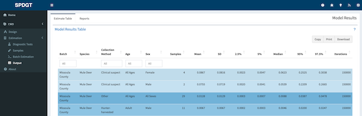

 
 

## Suggestions

If you have suggestions or corrections that you would like to propose to this document please either file a bug report at [this link](https://github.com/SpeedGoat/DiseaseMonitoring/issues/new?assignees=Huh&labels=bug&template=bug_report.md&title=) or make a contribution and issue a pull request via the [Huh/Help_Pages](https://github.com/SpeedGoat/Help_Pages) GitHub repository.

***

Developed by [SpeedGoat](https://www.speedgoat.io)

 

***

 

